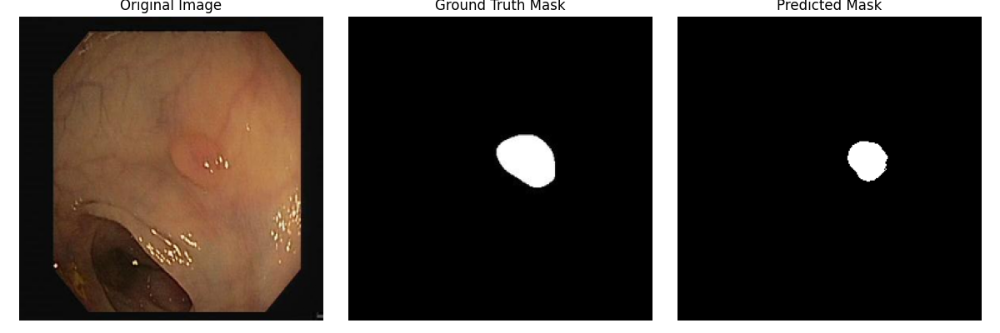

Polyp Segmentation Using U-Net

Overview

This project utilizes the U-Net architecture for segmenting polyps from medical images. Accurate polyp segmentation is crucial for early detection and diagnosis of diseases like colorectal cancer. The model was trained and evaluated on a dataset of medical images and corresponding masks.

Dataset:

CVC-ClinicDB Dataset: https://polyp.grand-challenge.org/CVCClinicDB/
Libraries/Modules:

Pillow (PIL): Pillow Documentation
NumPy: NumPy Documentation
TensorFlow: TensorFlow Documentation
pandas: pandas Documentation
glob: glob Documentation
scikit-learn (train_test_split): scikit-learn Documentation
tqdm: tqdm Documentation
Matplotlib: Matplotlib Documentation

Results
	•	Performance Metrics:
	•	Dice Coefficient: 92%
	•	IoU: 89%
	•	Sample Outputs:
	•	Input Image:

	•	Ground Truth Mask, Predicted Mask:
 - **Input Image**:
  

Technologies
	•	Programming Language: Python
	•	Deep Learning Framework: TensorFlow/Keras
	•	Other Libraries: NumPy, Pandas, Matplotlib
	•	Tools: Jupyter Notebook

License

This project is licensed under the MIT License. See the LICENSE file for details.

